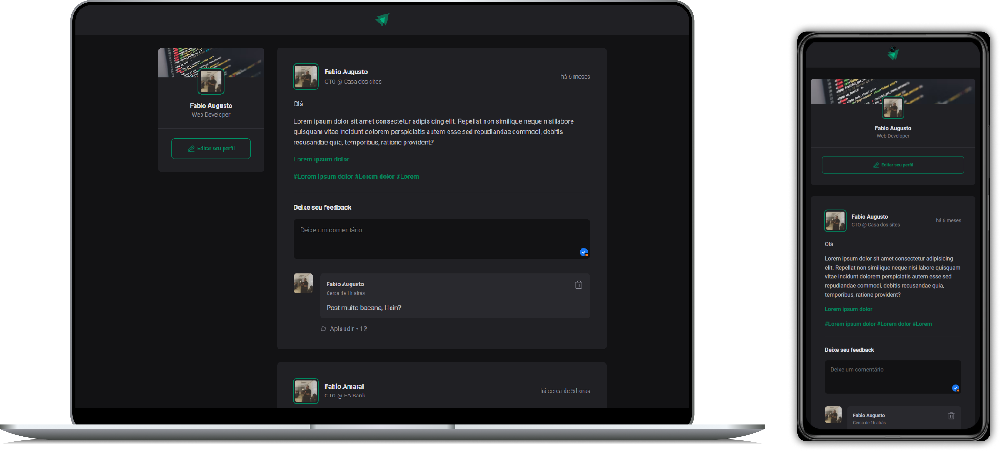

# Projeto Ignwes | Rocketseat

Neste projeto desenvolvemos com React um sistema de comentários, curtidas e depoimentos.

### Veja o projeto online

🚀 [Link do projeto online](https://react-ignite-news-rocketseat.vercel.app/)

### Tecnologias Utilizadas

- React com Vite: ^18.3.1

### Funcionalidades

- Cadastrar posts
- Cadastrar e excluir comentários
- Aplaudir o comentário

### Bibliotecas

Biblioteca de icones para o projeto: https://phosphoricons.com/

```
npm i phosphor-react
```

Biblioteca para formatação de datas e calcular distancias entre datas

```
npm i date-fns
```

### Como Executar o Projeto

1. Clone o repositório:

   ```bash
   git clone https://github.com/fabiocasadossites/react-igniteNews-rocketseat.git
   ```

2. Navegue até o diretório do projeto:

   ```bash
   cd nome-do-repositorio
   ```

3. Atualize o projeto, Em seu terminal e na pasta do projeto

   ```bash
   npm install
   ```

4. Rodar o projeto

   ```bash
   npm run dev
   ```

<br>

## 👨‍💻 Expert

<p>
    
    <p>&nbsp&nbsp&nbspFabio Augusto<br>
    &nbsp&nbsp&nbsp
    <a href="https://github.com/fabiocasadossites">
    GitHub</a>&nbsp;|&nbsp;
    <a href="https://www.linkedin.com/in/fabioasa/">LinkedIn</a>
&nbsp;|&nbsp;
    <a href="https://www.fabioaugusto.dev/">
    Portfolio </a>
&nbsp;&nbsp;</p>
</p>
<br/>
<p>

💻 com ❤️ por [Fabio Augusto](https://github.com/fabiocasadossites)
